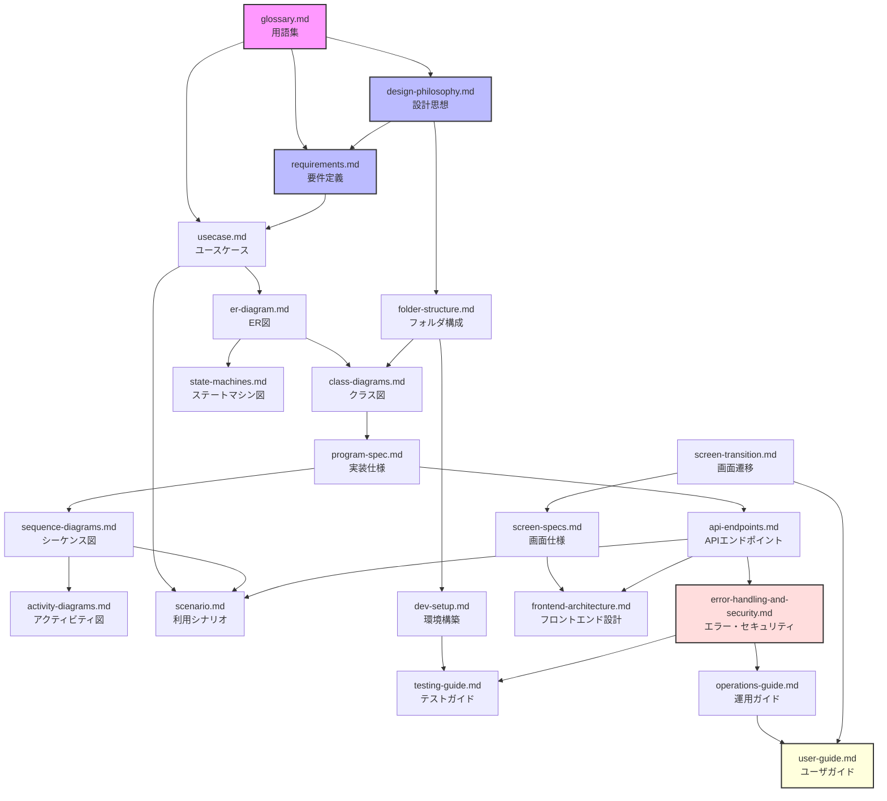

# gkill_autocomplete 設計資料集

## 概要

このディレクトリには gkill_autocomplete の設計資料を収録しています。

gkill_autocomplete は、[gkill](https://github.com/mt3hr/gkill) に溜まった記録を読み、
**まだタグの付いていない記録に対して付けるべきタグを提案する**ツールです。
判定にはローカルの LLM を使い、記録が外部へ送られることはありません。

### 作成の目的

- このツールが「何をして、何をしないか」を明文化する
- 設計判断の背景（なぜその形にしたか、何を避けたか）を残す
- gkill 本体の資料と同じ構成にして、行き来しやすくする

### 中心にある考え方

**提案するだけで、自分では書き込みません。** タグを付けるのは、確認画面で人が承認したときだけです。

**0個も正しい答えです。** すべての記録にタグが要るわけではありません。実際、記録の一定割合は
意図的にタグを付けないまま残されます。迷ったときに何かを提案するより、黙っているほうが利用者の手間は減ります。

**gkill と同じ端末で動かします。** 認証はそれを根拠にしており、資格情報を一切受け取りません。

詳しくは [design-philosophy.md](design-philosophy.md) を参照してください。

## 推奨する読み順

以下の順番で読むことを推奨します。前の資料の知識が後の資料の理解を助けます。

### 開発者向け

1. **[glossary.md](glossary.md)** — 用語集。最初に読んでください。以降の全資料で使う語（記録、文脈、候補タグ、段階、判定等）を定義しています。
2. **[design-philosophy.md](design-philosophy.md)** — 設計思想。なぜこの形になったか、何を避けたかを記録しています。
3. **[folder-structure.md](folder-structure.md)** — フォルダ構成。どこに何があるかを把握します。
4. **[requirements.md](requirements.md)** — 要件定義。何をどう提案するかの取り決めです。閾値や除外条件の根拠はここにあります。
5. **[usecase.md](usecase.md)** — ユースケース一覧（24件）。システムが「何をするか」を把握します。
6. **[er-diagram.md](er-diagram.md)** — ER図。保存するものとその関係、主キーが複合である理由を理解します。
7. **[class-diagrams.md](class-diagrams.md)** — クラス図。Go / TypeScript の型と依存の向きを理解します。
8. **[program-spec.md](program-spec.md)** — 実装仕様。パッケージ構成、データの流れ、主要な処理の詳細です。
9. **[sequence-diagrams.md](sequence-diagrams.md)** — シーケンス図。解析から承認までの処理の流れです。
10. **[scenario.md](scenario.md)** — 利用シナリオ集。はじめて使うところから複数アカウントまで、end-to-end の流れを追います。
11. **[activity-diagrams.md](activity-diagrams.md)** — アクティビティ図。処理手順のフローチャートです。
12. **[state-machines.md](state-machines.md)** — ステートマシン図。提案・記録・セッションの状態遷移です。
13. **[screen-transition.md](screen-transition.md)** — 画面遷移図。確認画面の出し分けを理解します。
14. **[screen-specs.md](screen-specs.md)** — 画面仕様。項目定義とキー操作の詳細です。
15. **[frontend-architecture.md](frontend-architecture.md)** — フロントエンド設計ガイド。Vue 3 + PWA 実装の詳細です。
16. **[api-endpoints.md](api-endpoints.md)** — APIエンドポイント一覧。自分が生やす7件と、gkill から借りる5件のリファレンスです。
17. **[error-handling-and-security.md](error-handling-and-security.md)** — エラーハンドリング・セキュリティ設計。認証と個人情報の扱いです。
18. **[dev-setup.md](dev-setup.md)** — 開発環境の構築とビルド手順です。
19. **[testing-guide.md](testing-guide.md)** — テストの実行方法と、本番を汚さない検証手順です。
20. **[operations-guide.md](operations-guide.md)** — 導入と運用の手順です。

### 利用者向け

1. **[user-guide.md](user-guide.md)** — 使い方。インストール、基本操作、困ったときの対処です。

## 各資料の概要

| ファイル | 内容 | 主な読者・用途 |
| --- | --- | --- |
| [glossary.md](glossary.md) | 用語の定義 | 全員。用語確認時に随時参照 |
| [design-philosophy.md](design-philosophy.md) | 設計判断とその理由 | 設計の背景を知りたいとき |
| [folder-structure.md](folder-structure.md) | ディレクトリ構成 | 初回参照、ファイル探索時 |
| [requirements.md](requirements.md) | 提案の取り決め・閾値の根拠 | 全員。設定を調整するとき |
| [usecase.md](usecase.md) | ユースケース一覧（24件） | 機能仕様の把握、テスト設計 |
| [er-diagram.md](er-diagram.md) | 保存するものと関係（Mermaid） | 保存先の理解、移行を考えるとき |
| [class-diagrams.md](class-diagrams.md) | Go / TS の型と依存（Mermaid） | コード構造の理解、実装時の参照 |
| [program-spec.md](program-spec.md) | 実装の詳細 | アーキテクチャの深い理解 |
| [sequence-diagrams.md](sequence-diagrams.md) | 主要処理のシーケンス図 | 処理フローの理解、デバッグ |
| [scenario.md](scenario.md) | 利用シナリオ集（end-to-end） | 実利用フローの全体理解 |
| [activity-diagrams.md](activity-diagrams.md) | 処理手順のフローチャート | 詳細な手順の確認 |
| [state-machines.md](state-machines.md) | 状態遷移図 | 「復活しない」の仕組みの理解 |
| [screen-transition.md](screen-transition.md) | 画面の出し分け | UI 実装・改修時の参照 |
| [screen-specs.md](screen-specs.md) | 画面仕様・項目定義 | UI 実装・改修時の参照 |
| [frontend-architecture.md](frontend-architecture.md) | Vue 3 + PWA 設計ガイド | フロントエンド開発者向け |
| [api-endpoints.md](api-endpoints.md) | API リファレンス（自前7件 / gkill 5件） | API 利用・実装時の参照 |
| [error-handling-and-security.md](error-handling-and-security.md) | エラー処理方針・認証・個人情報 | セキュリティレビュー、エラー実装 |
| [dev-setup.md](dev-setup.md) | 開発環境構築とビルド | 新規開発者のオンボーディング |
| [testing-guide.md](testing-guide.md) | テスト実行・検証手順 | テスト実行、テスト追加時の参照 |
| [operations-guide.md](operations-guide.md) | 導入・運用・トラブルシューティング | 運用担当者、環境構築時 |
| [user-guide.md](user-guide.md) | 利用者向け導入・操作ガイド | エンドユーザ |

## 資料間の依存関係

**矢印の読み方**: `A → B` は「A を先に読むと B の理解が容易になる」ことを意味します。
紫は基盤、青は設計判断、赤は安全に関わるもの、黄色は利用者向けです。

主な依存の流れ:

- **glossary.md** は全資料の基盤です。必ず最初に読んでください。
- **design-philosophy.md** → **requirements.md** → **usecase.md** と、
  考え方から取り決め、そして「何をするか」へ具体化されます。
- **er-diagram.md** → **class-diagrams.md** → **program-spec.md** → **sequence-diagrams.md**
  → **activity-diagrams.md** と、データ構造からコード構造、処理フローへ段階的に詳細化されます。
- **screen-transition.md** → **screen-specs.md** → **frontend-architecture.md** は、
  画面の出し分けから項目定義、実装の詳細へ進みます。
- **api-endpoints.md** → **error-handling-and-security.md** は、API の仕様から
  エラー処理と認証の方針へ進みます。
- **user-guide.md** は、operations-guide.md と screen-transition.md の知識を
  利用者向けにまとめたものです。

## 資料に書いてよいこと

**件数・構造・型は書いてよく、記録の中身は書いてはいけません。**

この資料集は公開されうる場所に置かれます。例示に使うタグ名・リポジトリ名・本文は
**すべて架空のもの**（`SampleRep`、`タグA` 等）にしてください。
実在の値は `gkill_autocomplete init` が生成する設定ファイルにだけ入り、そちらはリポジトリの外にあります。

件数の整合は `npm run verify_docs` が機械検査します。正しい数値は
`node src/tools/verify_docs.mjs --list` で引けます。数値を書いた資料を増やしたら、
`buildCountAssertions` に1行足してください。足し忘れると、その資料にだけ古い数値が残り続けます。

検査の内容:

| 検査 | 内容 |
| --- | --- |
| 件数 | 実測から組み立てた語句が資料に含まれているか |
| リンク | 相対リンクの先が実在するか |
| 参照パス | バッククォートで囲んだ `src/...` が実在するか（警告） |
| Mermaid | 空のブロック、種別不明の図が無いか |
| 架空の値 | 「種別_端末_日付」の形をした語が許可リストにあるか（警告） |

## Mermaid 図の閲覧方法

本資料集では Mermaid 記法による図を多数使用しています。以下の方法で閲覧できます。

- **GitHub** — `.md` ファイル内の Mermaid コードブロックは自動的にレンダリングされます
- **VS Code** — 拡張機能「[Markdown Preview Mermaid Support](https://marketplace.visualstudio.com/items?itemName=bierner.markdown-mermaid)」を入れるとプレビューで表示されます
- **Mermaid Live Editor** — [https://mermaid.live](https://mermaid.live) に貼り付けると確認・編集できます
