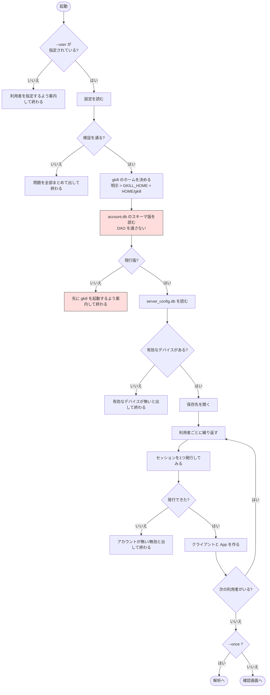
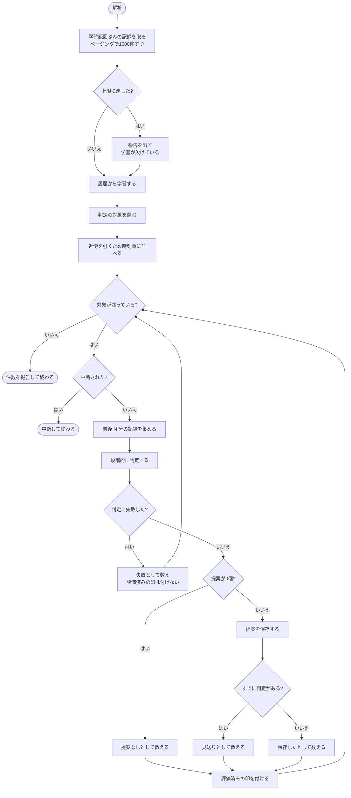
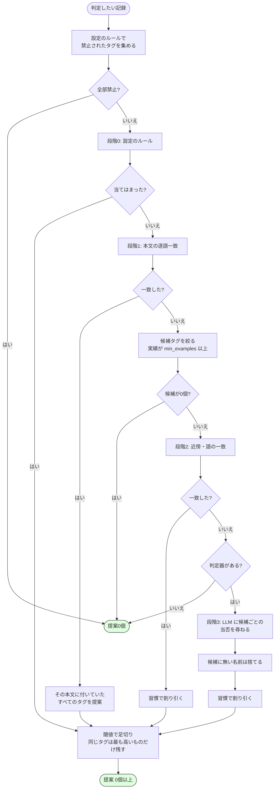
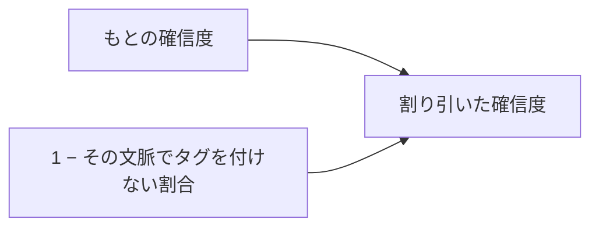
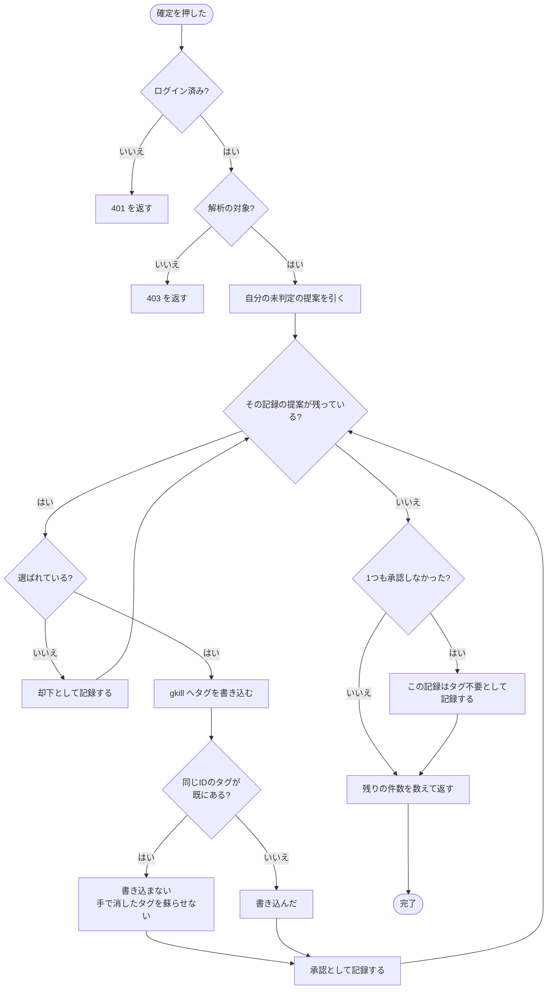
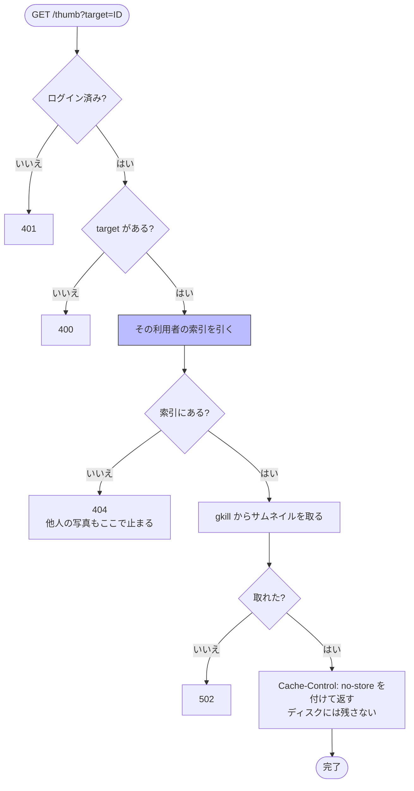
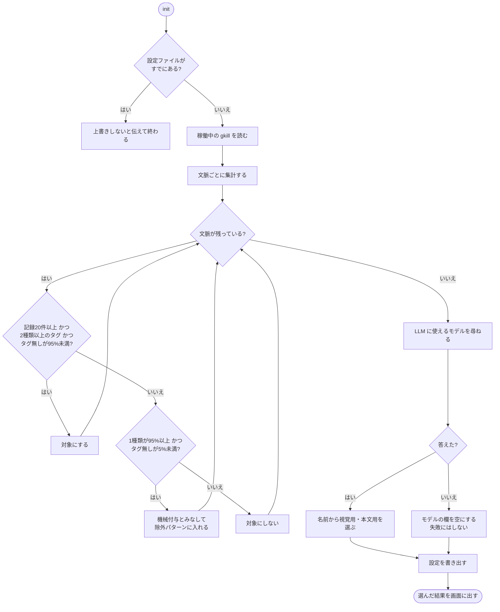
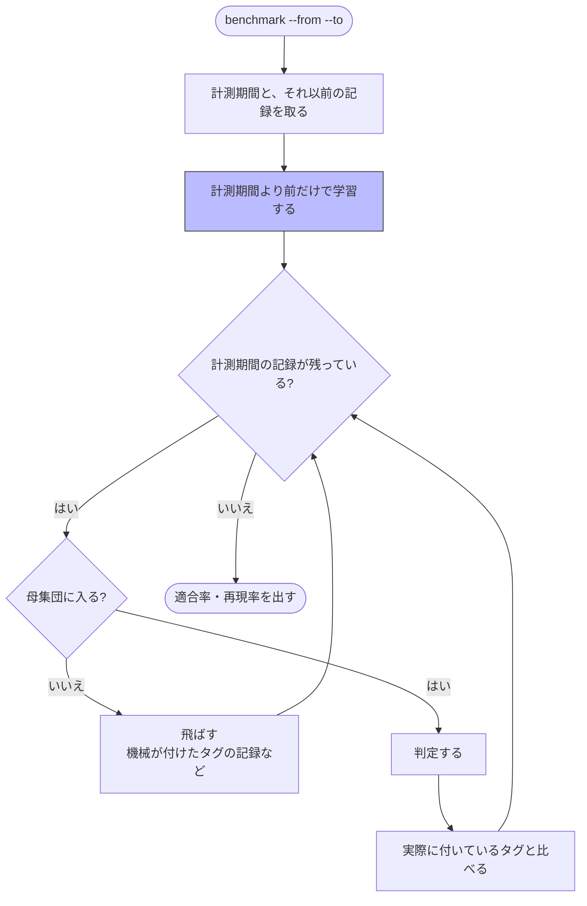

# アクティビティ図

処理の手順です。「なぜそうするか」は [design-philosophy.md](design-philosophy.md)、
「何を守るか」は [requirements.md](requirements.md) にあります。

## 1. 起動

**アカウントDBのスキーマを確かめる位置が要点です。** ここを飛ばすと、
gkill 側の自動移行で全アカウントのパスワードが無効化されます。

セッションを起動時に1つ試すのは、**アカウントの間違いを解析の前に見つける**ためです。
30分ぶんの記録を読んでから「そんなアカウントは無い」と言われては徒労になります。

## 2. 解析

**評価済みの印は、提案が0個だった記録にも付けます。** 付けないと、
毎回同じ記録に LLM を呼ぶことになります。

**判定に失敗した1件で解析全体を落としません。** LLM の時間切れ・応答の解釈失敗・
写真が取れない、はどれも実際に起きます。落とすと後ろに並んだ何十件もが処理されず、
しかも失敗した記録は評価済みにならないので、**何度やり直しても同じ場所で止まり続けます**。
飛ばして次へ進み、件数だけを報告します。

失敗した記録に評価済みの印を付けないのは意図的です。次の解析でやり直されます。

## 3. 判定（段階を降りる）

**上で決まれば下へ行きません。** 本文が過去の記録と逐語一致するなら、
それ以上何かを推測する必要はありません。

緑は正常な終わりです。**0個は失敗ではありません。**

### 習慣で割り引く

推測から出た確信度は当てになりません。実測では、写真の保管庫に対する LLM の判定が
**9件すべて 1.0** を返し、後付けの理由が付いていました。自己申告をそのまま
閾値にかけても何も濾せません。

一方「その場所でタグを付けているか」は履歴から数えられる事実です。
ほとんどタグを付けない場所では、よほど強い証拠が無い限り黙るのが正しい動きです。

**段階0と1は割り引きません。** 推測ではなく直接の証拠だからです。

## 4. 承認

**選ばれなかった提案は、同じ記録のぶんがまとめて却下になります。**
そうしないと同じ記録が何度も出てきます。

画面側は押した瞬間に一覧から外し、失敗したら元の位置へ戻します。

## 5. 写真の中継

**索引にしか無い経路です。** リポジトリ名やファイル名を外から渡させないので、
一覧に出ていない場所のファイルは読めません。索引は利用者ごとなので、
記録IDを知っているだけでは他人の写真は引けません。

## 6. 設定の生成（`init`）

**2種類以上のタグを使い分けている**ことを条件にしているのは、
そこで人の選択が起きている印だからです。1種類しか使われていない文脈は、
機械が一律に付けているか、そもそも選択の余地がありません。

## 7. 精度の計測（`benchmark`）

**学習を計測期間より前に限るのが要点です。** そうしないと自分の答えを見て
当てることになり、数字が意味を持ちません。

**保存先にも gkill にも一切書き込みません。**
