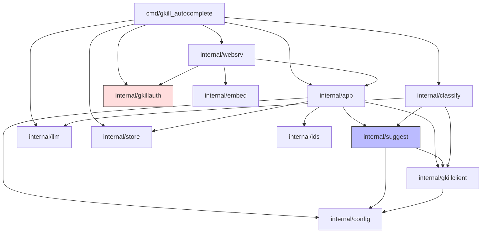
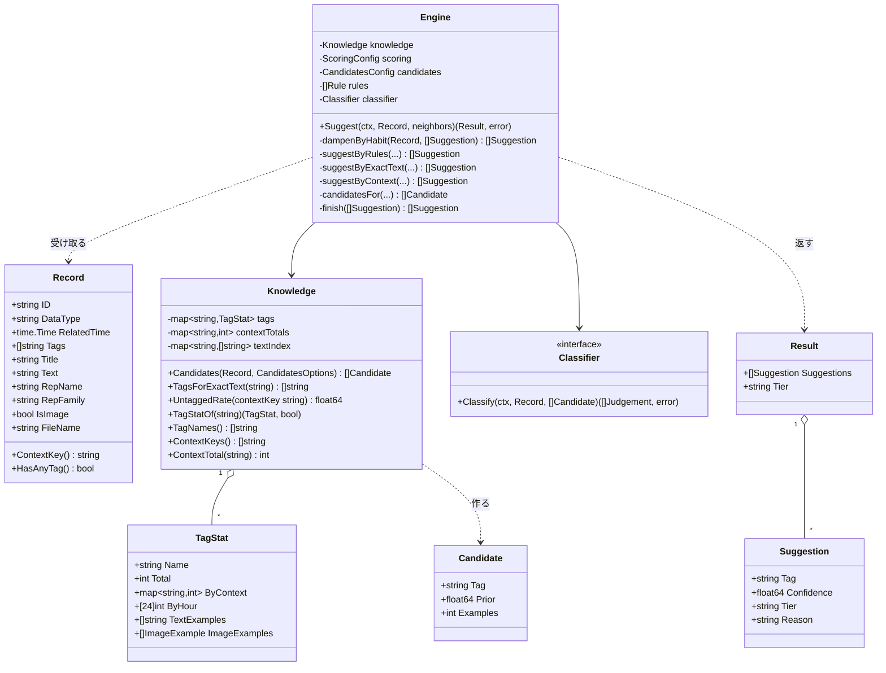
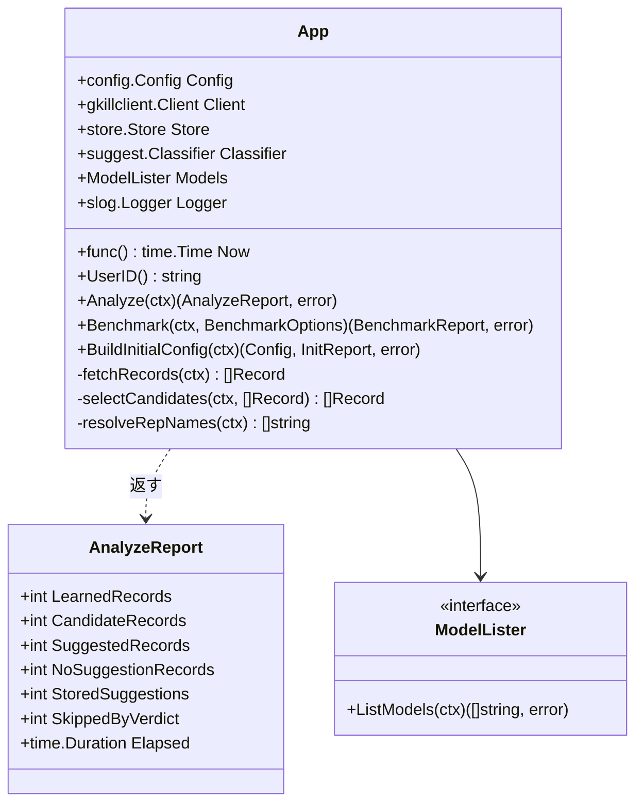
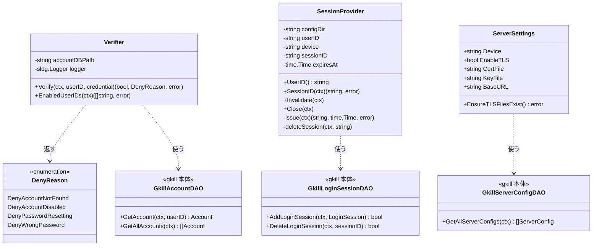
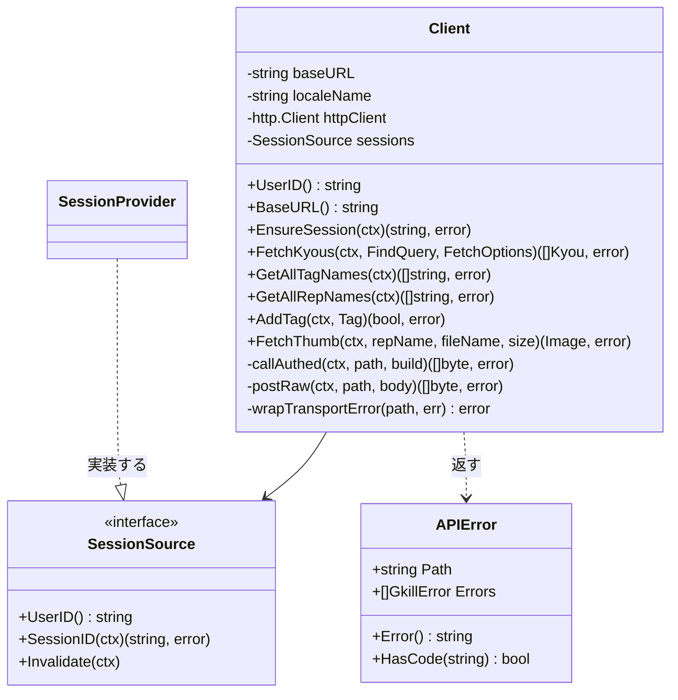
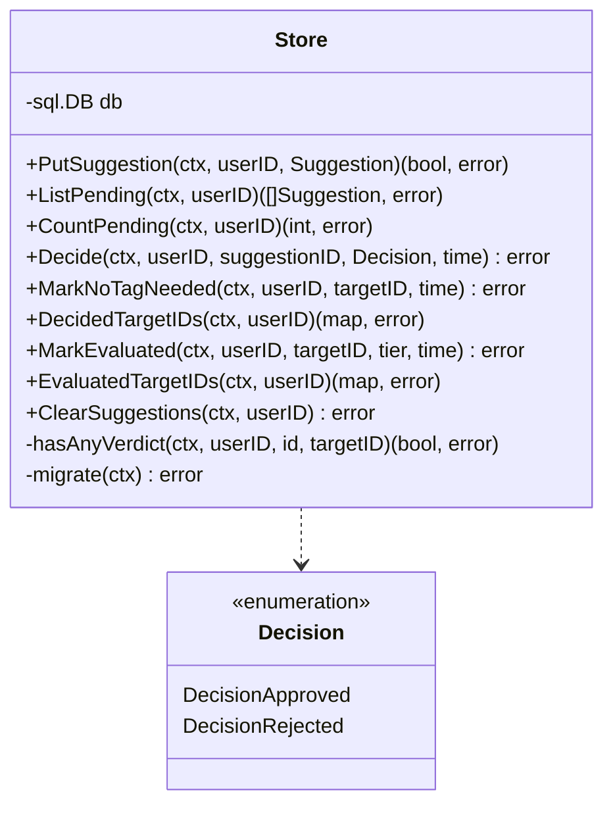
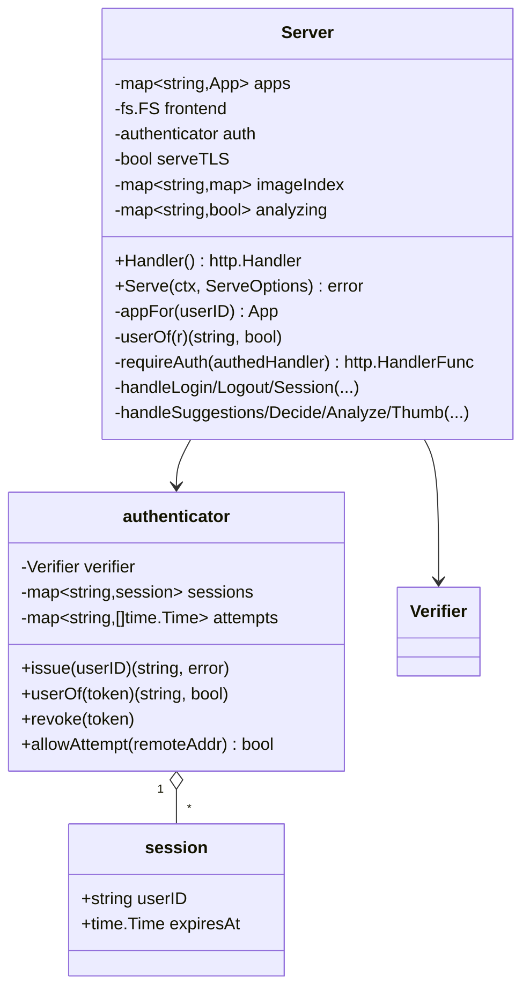
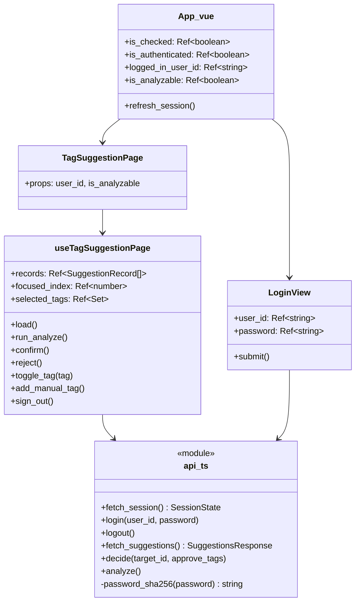

# クラス図

Go と TypeScript の主要な型と、その関係です。

## 1. パッケージの依存

依存は一方向です。`suggest` は `config` と `gkillclient` しか知らず、
`llm` や `websrv` を知りません。**LLM を差し替えても `suggest` は変わりません。**

赤は gkill 本体のコードを import する唯一の場所です。

## 2. 判定エンジン（`internal/suggest`）

**`Classifier` が境目です。** nil でも動きます（逐語一致と近傍による判定だけになる）。
LLM を使う実装は `internal/classify` にあり、`suggest` はそれを知りません。

### 段階を表す定数

| 定数 | 値 | 意味 |
| --- | --- | --- |
| `TierRule` | `rule` | 設定に書かれたルールで決まった |
| `TierTextMatch` | `text_match` | 本文が過去の記録と逐語一致した |
| `TierContext` | `context` | 近くの記録や語の一致から決まった |
| `TierLLM` | `llm` | LLM が判定した |
| `TierNone` | `none` | どの段階でも決まらなかった（提案0個） |

`TierNone` は失敗ではありません。**「タグを付けない」という正常な答え**です。

## 3. 全体の配線（`internal/app`）

**`App` は1人ぶんです。** `Client` が持つセッションはある利用者のものなので、
取れる記録もその人のリポジトリに限られます。複数人を扱うときは人数ぶん作り、
`Store` だけを共有して行を `USER_ID` で分けます。

`AnalyzeReport` に入るのは**件数と所要時間だけ**です。記録の中身は入りません。

## 4. 認証（`internal/gkillauth`）

`DenyReason` は**利用者に返しません**。応答は常に同じ文面で、理由はログにだけ残します。
返すとアカウントの存在や状態を外から探れてしまうためです。

## 5. gkill との通信（`internal/gkillclient`）

**`Client` は「どうやってセッションを手に入れるか」を知りません。**
`SessionSource` 越しに受け取るので、この層は認証の仕組みから独立しています。
テストでは固定値を返す実装を差し込みます。

## 6. 保存先（`internal/store`）

**すべてのメソッドが `userID` を取ります。** 空を渡すと `ErrEmptyUserID` で弾かれます。
空を許すと、その行はどの利用者からも見えない迷子になるか、逆に条件次第で他人に見えます。

## 7. 確認画面（`internal/websrv`）

`imageIndex` と `analyzing` が**利用者ごとの map** になっているのが要点です。
索引を共有すると、記録IDを知っているだけで他人の一覧に載った写真を引けてしまいます。

## 8. 確認画面のフロント（TypeScript）

画面の動きは `useTagSuggestionPage` に寄せ、`.vue` は見た目だけを持ちます
（gkill 本体のコンポーザブルと同じ形）。詳細は
[frontend-architecture.md](frontend-architecture.md) を参照してください。
