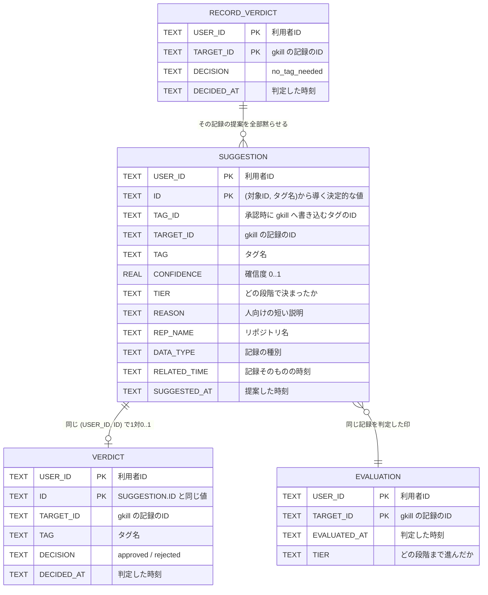

# ER図

保存するものと、その関係です。

このツールが持つ実体は**提案と人間の判定だけ**です。記録そのものは gkill にあり、
こちらには置きません。画面に出すものは、そのつど gkill から取り直します。

## 1. 全体



外部キー制約は張っていません。`TARGET_ID` の指す先は gkill にあり、
こちらからは存在を保証できないためです（gkill 側で記録が消えることもあります）。

## 2. 表の性質

**性質の違う2種類が同居しています。** 消してよいものと、消してはいけないものです。

| 表 | 性質 | 失ったら | `reset` で |
| --- | --- | --- | --- |
| `SUGGESTION` | 派生データ | 解析し直せば戻る | **消える** |
| `EVALUATION` | 派生データ | 解析し直せば戻る | **消える** |
| `VERDICT` | **再生成できない** | 却下したはずの提案が永久に出続ける | 残る |
| `RECORD_VERDICT` | **再生成できない** | タグ不要にした記録が毎回蒸し返される | 残る |

`ClearSuggestions` が触るのは上の2つだけです。この境界を崩すと、
このツールの中心にある「却下したものが復活しない」が壊れます。

## 3. 主キーが複合である理由

**すべての表の主キーに `USER_ID` が入っています。**

gkill では同じ人でもアカウントごとに別のリポジトリを持ちます。そして
**あるアカウントが別のアカウントのリポジトリをまとめて抱えている構成が普通にあります**。
その場合、同じ記録IDが両方の利用者に現れます。

`ID` だけを主キーにすると、片方の利用者の判定がもう片方を上書きしてしまいます。

```mermaid
erDiagram
    USER_A["利用者A"] ||--o{ RECORD["記録 target-1"] : "見える"
    USER_B["利用者B(Aのリポジトリも抱えている)"] ||--o{ RECORD : "見える"
    RECORD ||--o{ VERDICT_A["VERDICT(A, ...)"] : ""
    RECORD ||--o{ VERDICT_B["VERDICT(B, ...)"] : ""
```

A が却下しても B の未判定は残ります。逆も同じです。

## 4. 識別子の導き方

`SUGGESTION.ID` と `SUGGESTION.TAG_ID` は**乱数を使いません**。
`(対象の記録ID, タグ名)` から決まる UUIDv5 です。

```
ID     = UUIDv5(名前空間A, targetID + "\x00" + tagName)
TAG_ID = UUIDv5(名前空間B, targetID + "\x00" + tagName)
```

これで次の2つが同時に成り立ちます。

| 性質 | 効果 |
| --- | --- |
| 何度解析しても同じ値 | 再解析で提案が重複しない |
| gkill 側でも同じ値 | 手で消したタグを承認しても**蘇らない**（gkill が `ERR000056` を返し、こちらは「何もしなかった」として扱う） |

区切りに `\x00` を挟んでいるのは、`("ab", "c")` と `("a", "bc")` を別物にするためです。

## 5. gkill 側との関係

こちらが持つのは `TARGET_ID` という参照だけです。記録の中身は持ちません。

```mermaid
erDiagram
    LOCAL_SUGGESTION["SUGGESTION (こちら)"] }o--|| GKILL_KYOU["Kyou (gkill)"] : "TARGET_ID で参照"
    GKILL_KYOU ||--o{ GKILL_TAG["Tag (gkill)"] : "承認するとここに増える"
    LOCAL_SUGGESTION }o--|| GKILL_TAG : "TAG_ID が一致"
```

**中身を持たないのは意図です。** 画面に出すものをそのつど取り直すことで、
gkill 側で記録を直したり消したりした結果がそのまま反映されます。
消えた記録は画面から静かに落ちます。

## 6. 索引

| 索引 | 用途 |
| --- | --- |
| `INDEX_SUGGESTION_TARGET (USER_ID, TARGET_ID)` | 承認時に「同じ記録の他の提案」を畳む |
| `INDEX_SUGGESTION_RELATED_TIME (USER_ID, RELATED_TIME DESC)` | 一覧を新しい順に並べる |
| `INDEX_VERDICT_TARGET (USER_ID, TARGET_ID)` | 判定済みの記録を引く |

いずれも先頭が `USER_ID` です。**すべての問い合わせが利用者で絞られる**ためで、
先頭でなければ索引が効きません。

## 7. 置き場

```
$GKILL_AUTOCOMPLETE_HOME/gkill_autocomplete.db   （既定 $HOME/gkill_autocomplete/）
```

**リポジトリの中には作りません。** 所有者だけが読める権限にします。

SQLite の設定は次のとおりです。

| 設定 | 値 | 理由 |
| --- | --- | --- |
| `journal_mode` | WAL | 解析中に確認画面から読まれても待たせない |
| `busy_timeout` | 6000ms | 解析と画面が同時に触りうる |
| `synchronous` | NORMAL | WAL と組で使う既定的な選択 |

**バックアップが要るのはこの1ファイルだけです。** 設定は `init` で作り直せますが、
人間の判定はどこにもありません。
