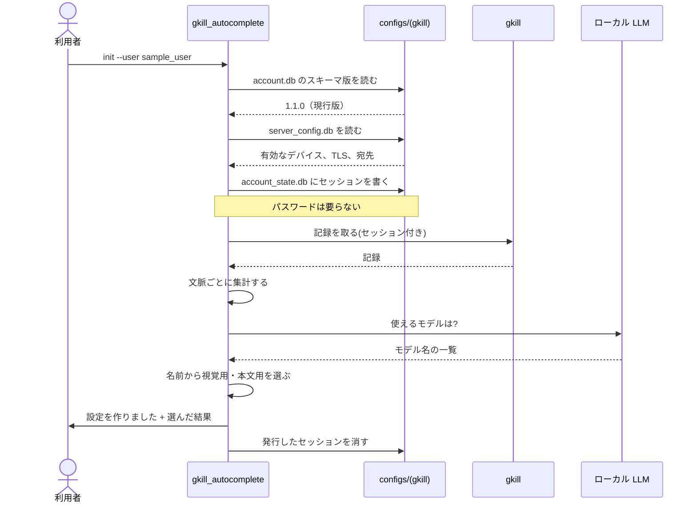
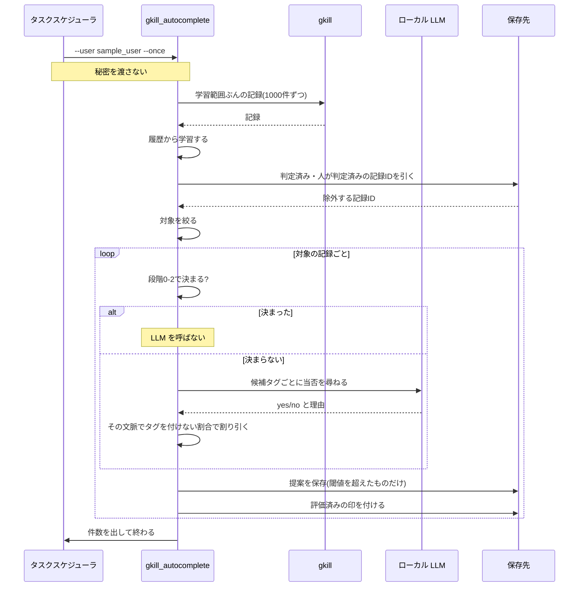
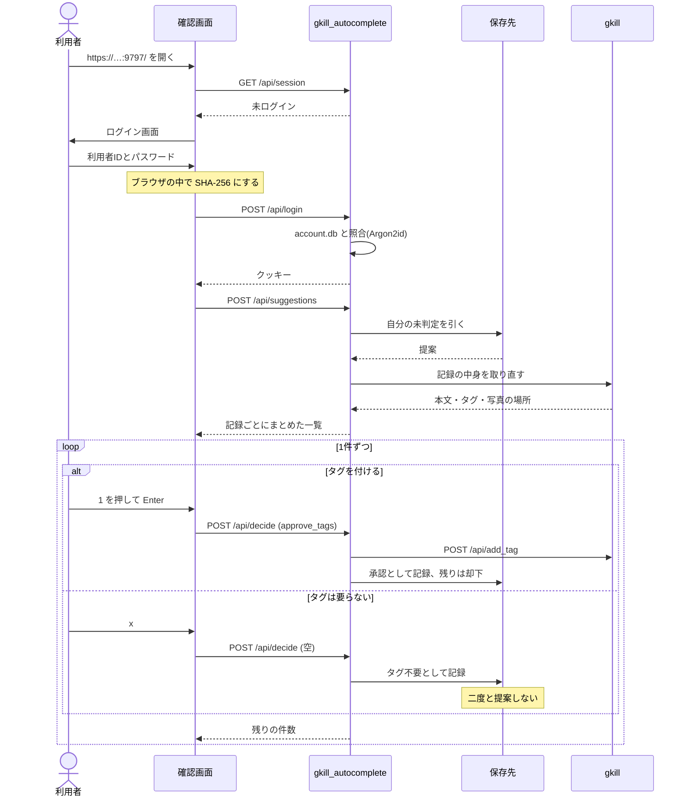
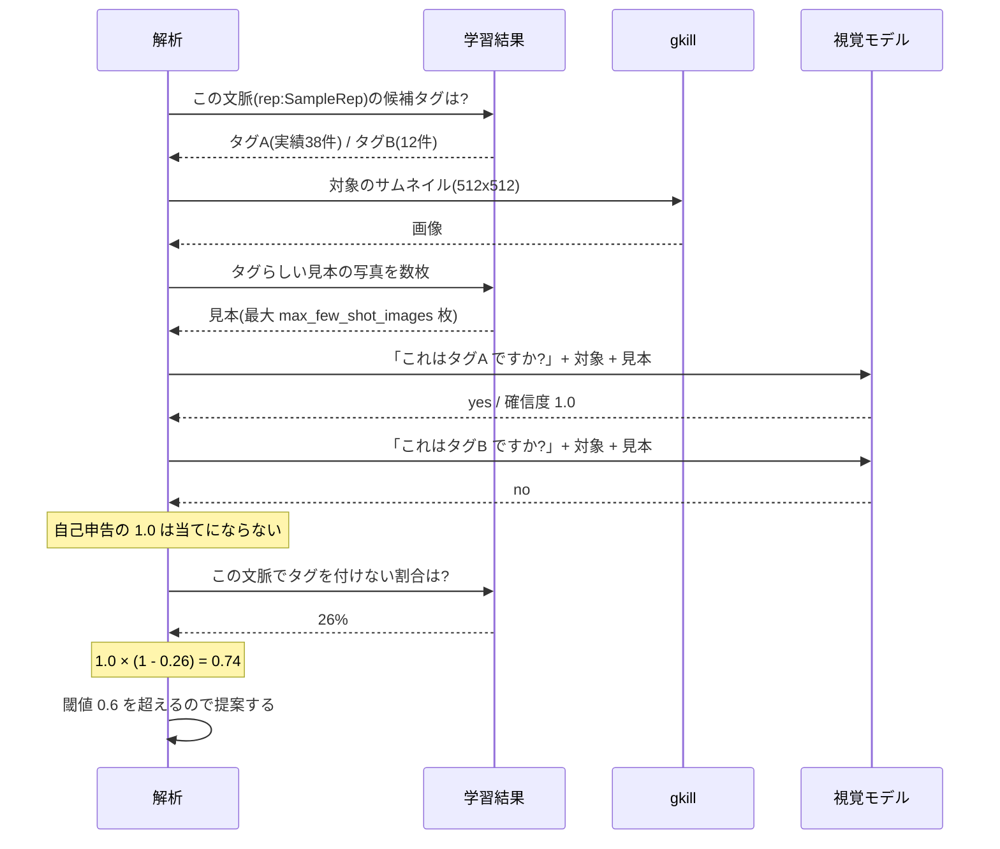
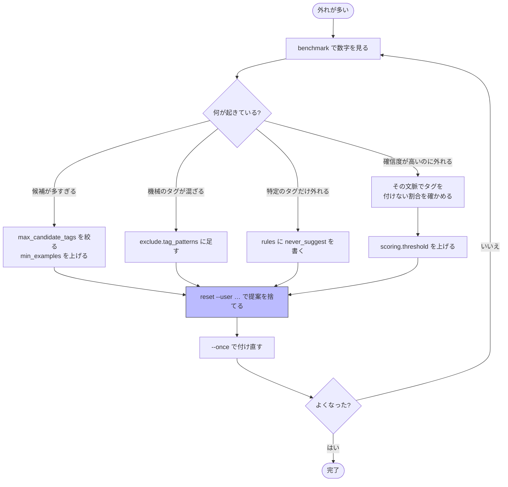
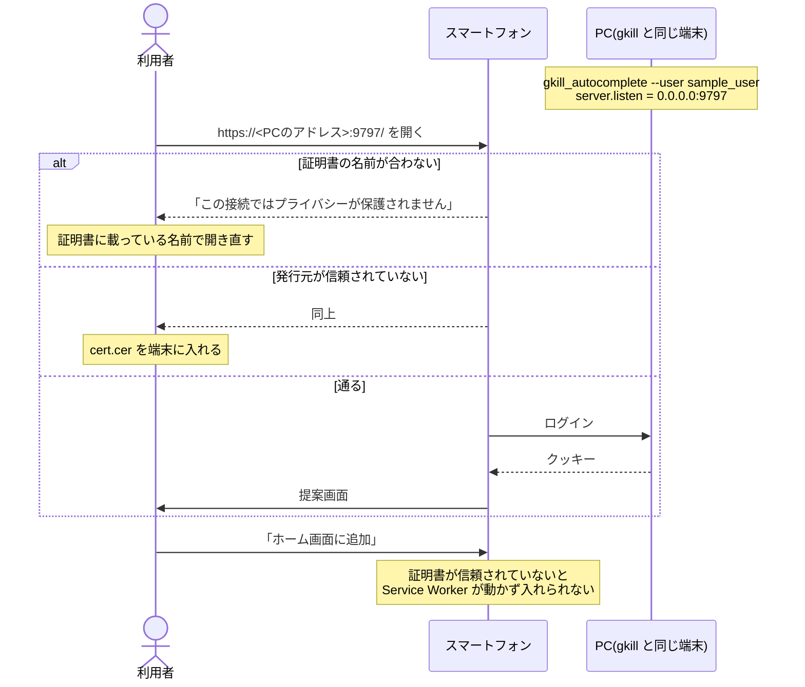
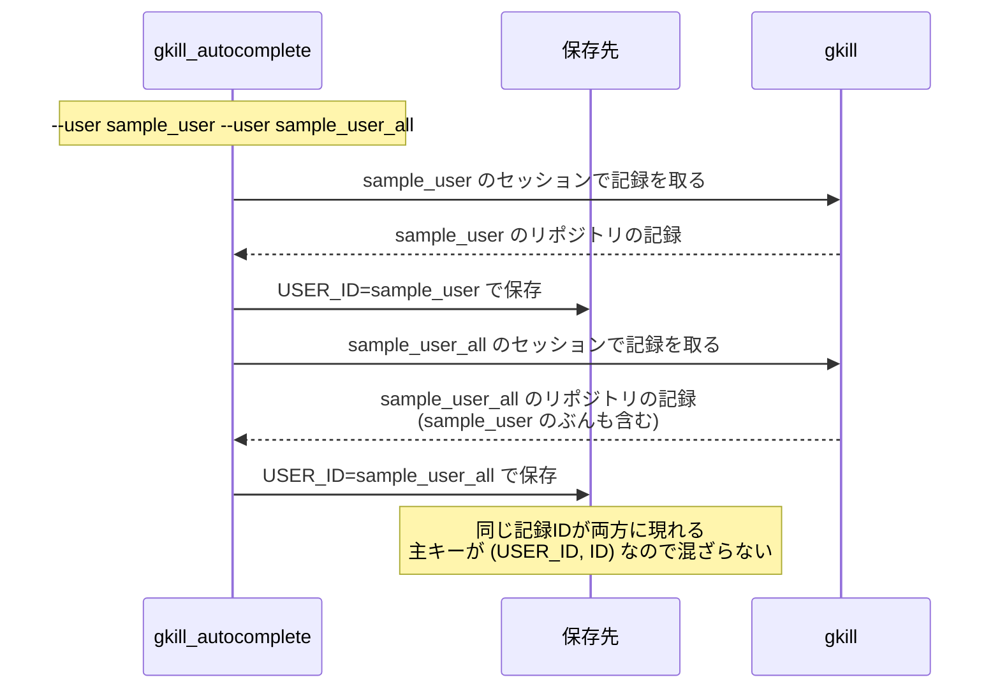
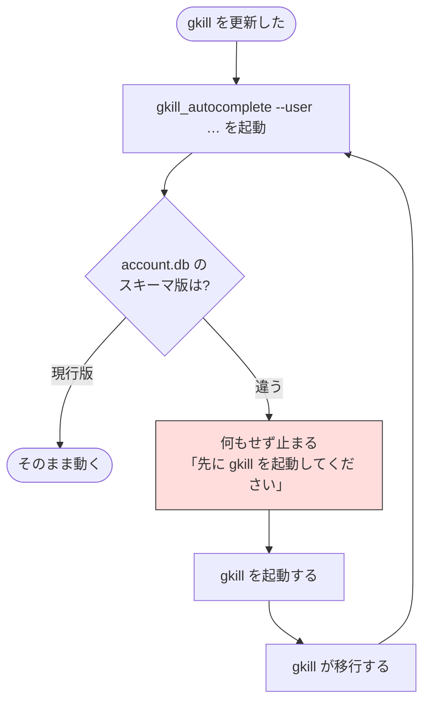
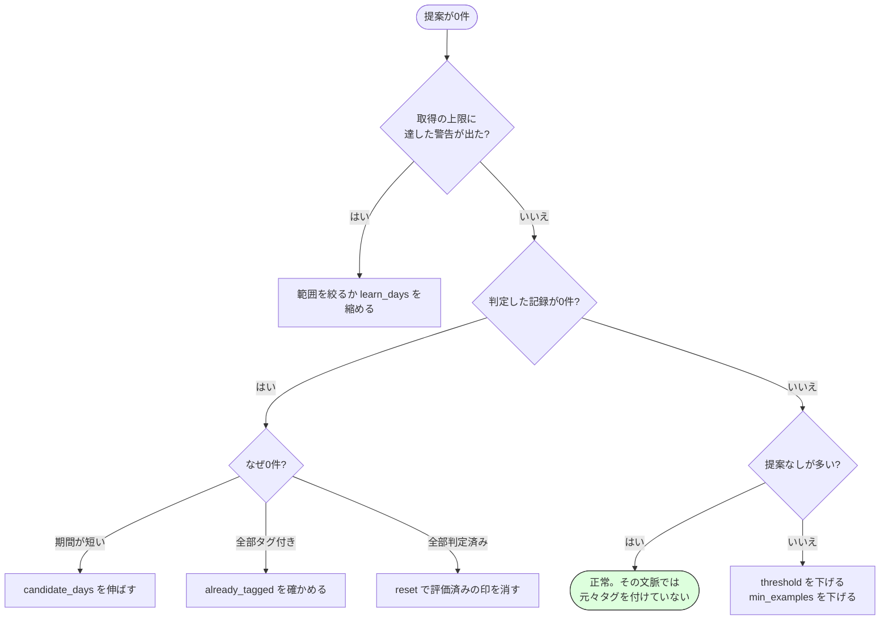

# 利用シナリオ集

実際の使い方を、端から端まで追います。個々の仕様ではなく
**「そのとき何が呼ばれ、どう動くか」**を通しで見るための資料です。

例に出るタグ名・リポジトリ名はすべて架空のものです。

## シナリオ1: はじめて使う

**状況**: gkill を使い続けて記録が溜まっている。手でタグを付けるのが面倒になってきた。

**ここで何が決まるか**:

- どの文脈を対象にするか（2種類以上のタグを使い分けている場所）
- どのタグを候補から外すか（1種類が場を占めている＝機械付与とみなす）
- どのモデルを使うか

生成された設定を開いて、対象が意図どおりか確かめます。
**実在のタグ名・リポジトリ名が入るのはこのファイルだけ**で、リポジトリの外にあります。

---

## シナリオ2: 夜に解析して、朝に確認する

**状況**: 定期実行に登録して、溜まったぶんを朝まとめて捌きたい。

### 夜（自動）

**LLM を呼ばずに済む記録が多いほど速く終わります。** 定型の記録
（同じ操作を繰り返して生まれるもの）は段階1で片付きます。

### 朝（手動）

**キーボードだけで捌けます。** `x` が最短なのは、
記録の一定割合が元々タグを必要としないためです。

---

## シナリオ3: 写真にタグを付ける

**状況**: 飲み物の写真が溜まっている。中身によってタグを分けたい。

**割り引きが効くところです。** 実測では、写真の保管庫に対する LLM の判定が
9件すべて 1.0 を返し、後付けの理由が付いていました。
自己申告をそのまま閾値にかけても何も濾せません。

「その場所でタグを付けているか」は履歴から数えられる事実なので、そちらで補正します。

### 写真を渡すときの注意

| 事項 | 理由 |
| --- | --- |
| サムネイルは各辺 1〜1024 | 範囲外だと gkill は**エラーではなく原本（全画素）**を返す |
| 見本は枚数に注意 | 写真は1枚で千数百トークン。数枚で文脈長を超えて判定が失敗する |
| 渡すのは画像と候補タグ名だけ | ID・リポジトリ名・ファイル名・場所は渡さない |

---

## シナリオ4: 誤った提案が続くので調整する

**状況**: 12件のうち11件が外れた。設定を見直したい。

**`reset` は人間の判定を消しません。** 提案と「評価済みの印」だけを捨てるので、
却下したものが復活することはありません。

`benchmark` は既にタグを付け終えた過去の期間で測ります。学習には計測期間より前の
記録だけを使うので、自分の答えを見て当てることはありません。
**保存先にも gkill にも一切書き込みません。**

---

## シナリオ5: 別の端末から確認する

**状況**: 寝る前にスマートフォンで捌きたい。

**証明書は gkill 本体のものをそのまま使います。** 専用のものを作らないのは、
利用者に証明書をもう1枚信頼させないためです。

そのぶん、**その証明書がどの名前を保証しているか**を確かめる必要があります。
確かめ方は [operations-guide.md](operations-guide.md) の3章にあります。

---

## シナリオ6: 複数のアカウントを扱う

**状況**: 用途で gkill のアカウントを分けている。両方にタグを付けたい。

**同じ記録を2人が別々に判定できます。** 片方で却下しても、もう片方の未判定は残ります。

画面では、ログインした本人の提案しか見えません。
`--user` に渡していないアカウントでもログインはできますが、
提案は空になり、画面が「対象に含まれていません」と出します。

---

## シナリオ7: gkill を更新したあと

**状況**: gkill を新しい版に上げた。

**こちらでは移行しません。** gkill のアカウント DAO は旧スキーマの DB を
開いた瞬間に自動移行を走らせ、**全アカウントのパスワードを無効化します**。
先に開いてしまうと、gkill にログインできなくなります。

なお、こちらが import している gkill のコードを上げるときは、
コミットを指定して `go get` します（[dev-setup.md](dev-setup.md) 1章）。

---

## シナリオ8: 何も提案されない

**状況**: 解析は終わったのに提案が0件。

**「提案なし」は失敗ではありません。** タグ履歴の無い文脈では候補タグが0個になり、
LLM を呼ばずに終わります。範囲を広げても費用が跳ねないのはこのためです。

時間がかかるのは「タグ履歴があり、かつ未タグの記録が残っている」文脈だけです。
