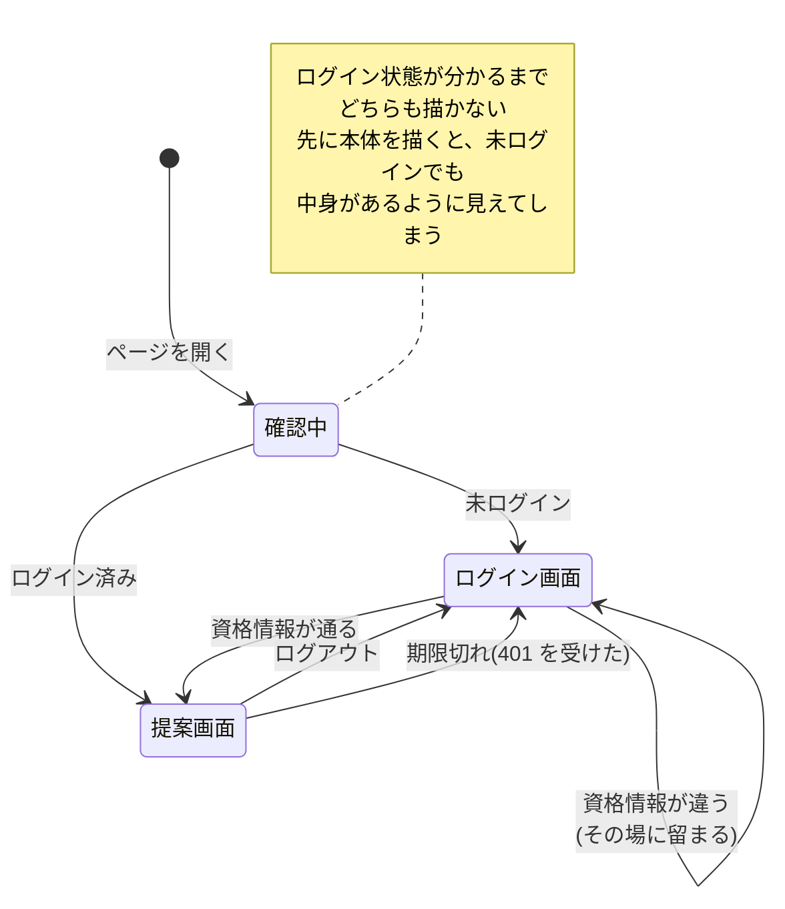
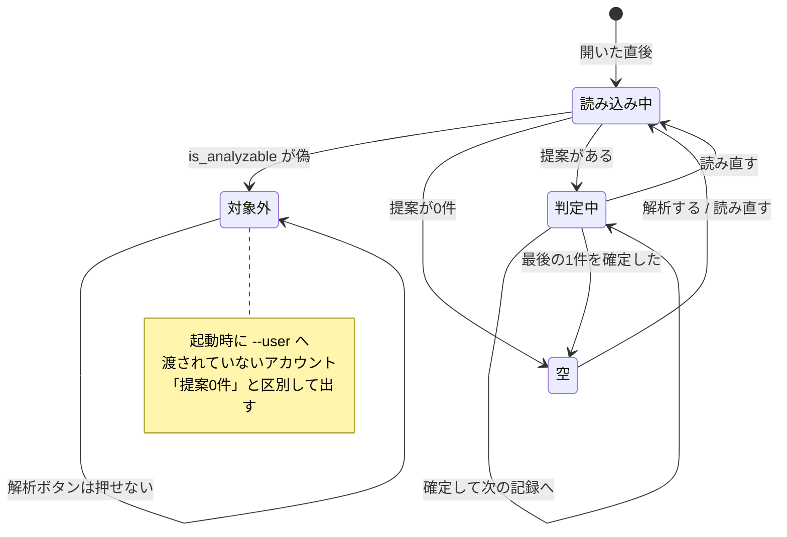
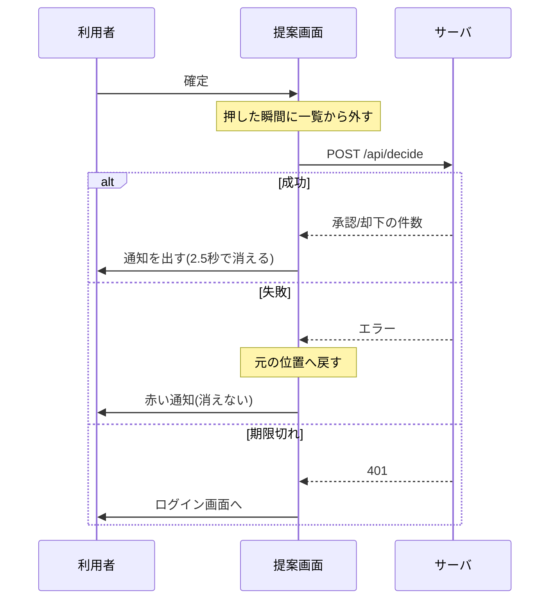
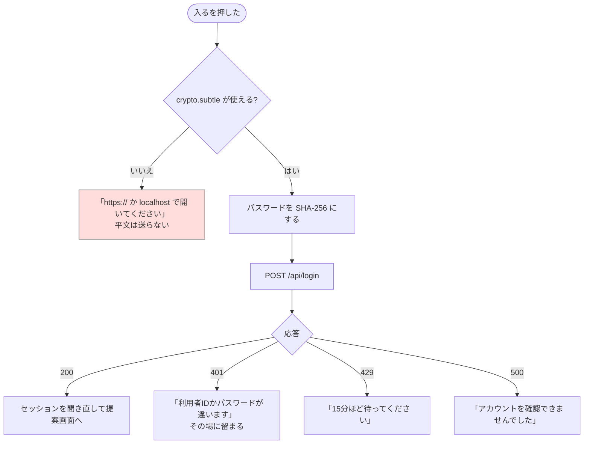
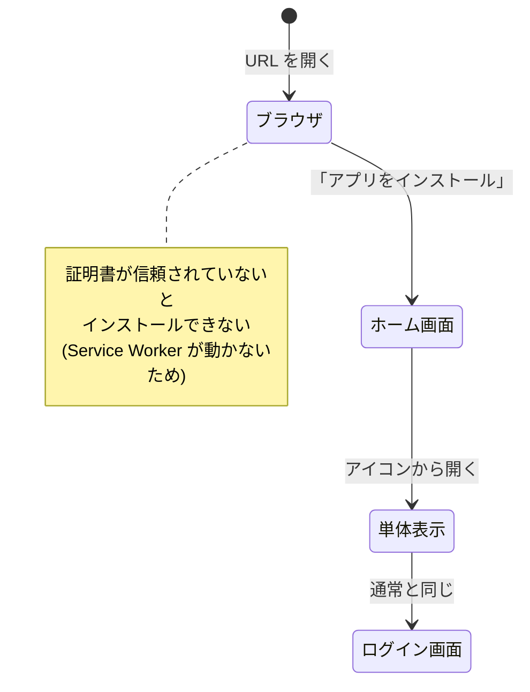

# 画面遷移図

確認画面は**1ページだけ**です。ルータもありません。出し分けは状態で行います。

## 1. 全体

`App.vue` が `is_checked` / `is_authenticated` の2つで出し分けます。
**`is_checked` が偽の間は何も描きません。**

## 2. 提案画面の中の状態

ページ遷移はありません。同じ画面が状態で姿を変えます。

**「空」と「対象外」を分けているのが要点です。** どちらも提案は出ませんが、
利用者がやるべきことが違います（前者は解析する、後者は起動しなおす）。

## 3. 操作と遷移

| 操作 | どこから | 何が起きるか |
| --- | --- | --- |
| 入る | ログイン画面 | 照合が通れば提案画面へ。**通らなければ留まる** |
| `j` / `↓` | 判定中 | 次の記録へ。選択は解除される |
| `k` / `↑` | 判定中 | 前の記録へ。選択は解除される |
| `1`〜`9` | 判定中 | その番号の候補タグを選ぶ／外す |
| `Enter` | 判定中 | 確定。**何も選んでいなければタグ不要** |
| `x` / `Delete` | 判定中 | タグ不要として確定 |
| 更新ボタン | どこでも | 解析を1回走らせ、終わったら読み直す |
| 読み直しボタン | どこでも | 一覧だけを取り直す |
| テーマボタン | どこでも | 星と雪を切り替える。クッキーに覚える |
| ログアウト | どこでも | ログイン画面へ |

キーボードは**文字を打っている最中には反応しません**（`input` / `textarea` /
`contenteditable` に焦点があるとき、および修飾キーが押されているとき）。
自分でタグを足す欄があるためです。

## 4. 確定したときの見え方

**先に外して、失敗したら戻します。** 待たせないためです。
同じ記録への二重確定は `in_flight` で防ぎます。

## 5. ログインできない場合の分かれ道

**平文へ落ちる道はありません。** 安全なコンテキストで開けないときは、
パスワードを送らずに理由を出して止まります。

401 の文面は**どの理由でも同じ**です（アカウントが無い・無効・リセット中・
パスワード違い）。アカウントの存在や状態を外から探れないようにするためです。

## 6. PWA としての入り口

単体表示（`display: standalone`）ではブラウザの枠が消えますが、
画面の中身と遷移は同じです。

**オフラインでは画面の器だけが開き、提案は出ません。** 記録の中身を
Service Worker に溜めない設計なので、これは意図した動きです。
