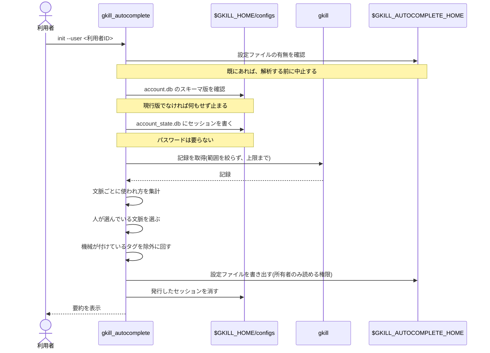
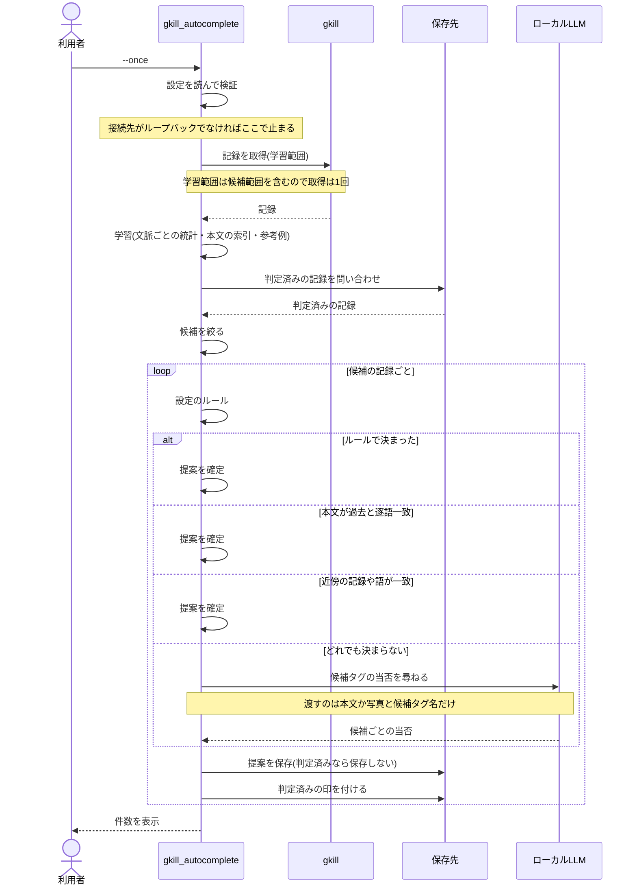
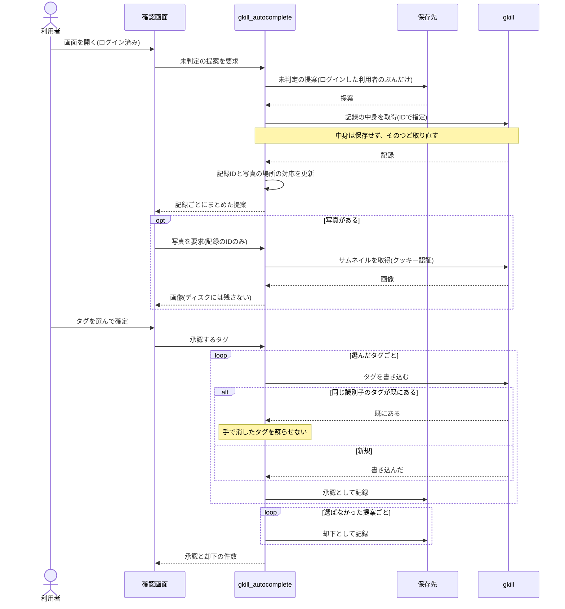
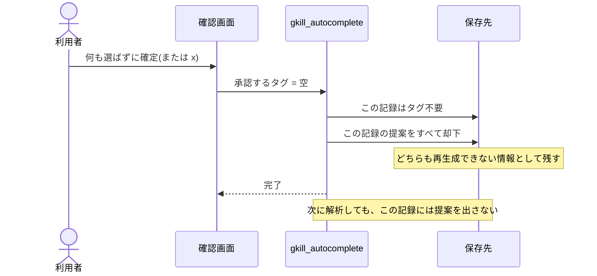
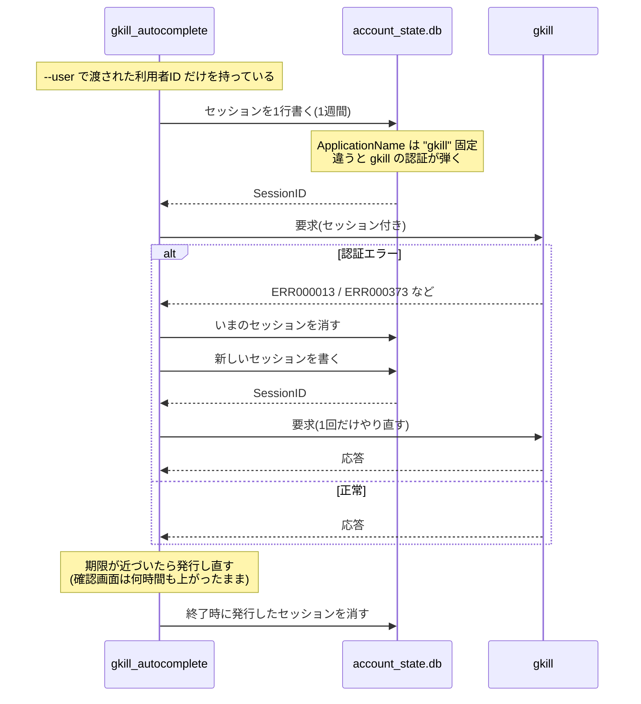
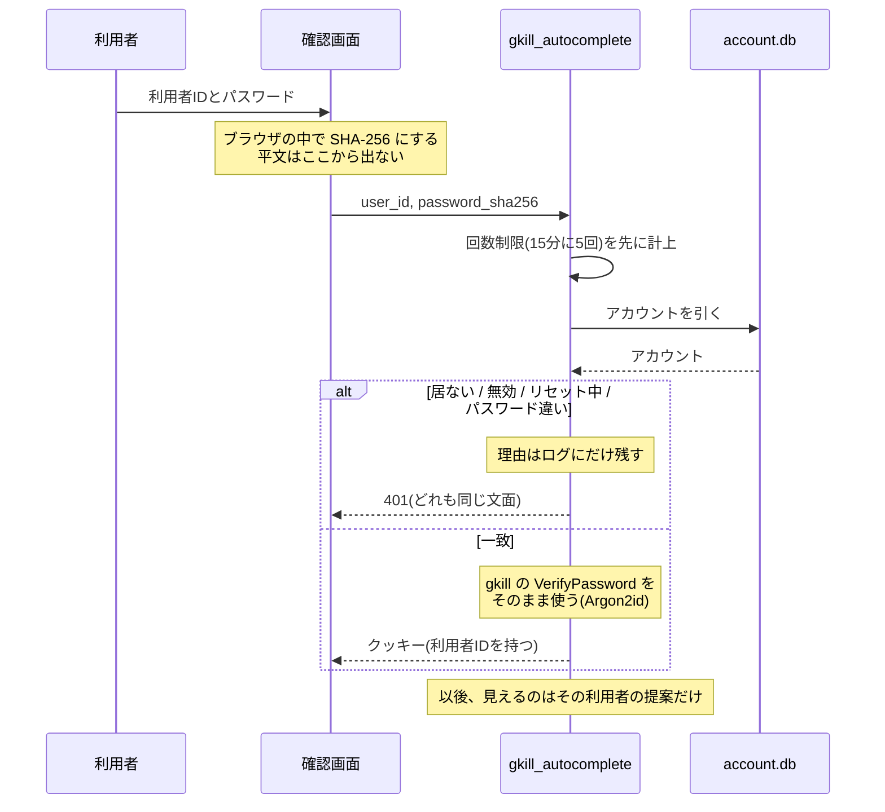
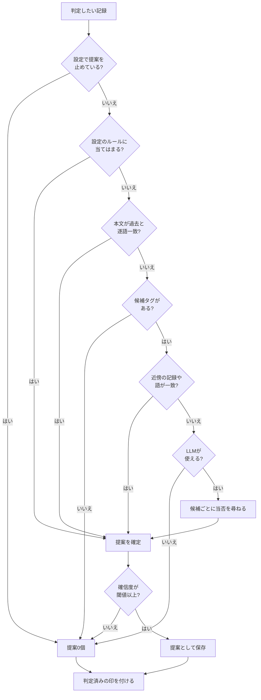

# シーケンス図

主要な処理の流れです。図は Mermaid で書かれています。閲覧方法は [README.md](README.md) を参照してください。

**時系列ではなく手順の分岐を見たい**場合は [activity-diagrams.md](activity-diagrams.md)、
**通しの使い方**を見たい場合は [scenario.md](scenario.md) を参照してください。

## 1. 設定の生成（`gkill_autocomplete init`）

## 2. 解析（`gkill_autocomplete --once`）

## 3. 確認と承認

## 4. タグ不要の判定

## 5. セッションの発行と取り直し

コマンドラインは資格情報を受け取りません。gkill を叩くためのセッションは、
gkill の設定ディレクトリへ直接書いて発行します。

**gkill の `/api/login` は一度も叩きません。** 叩くと gkill 側のログイン回数
（IP毎・15分に10回）を消費してしまうためです。

## 5.1 確認画面のログイン

## 6. 判定の段階（フローチャート）

提案0個は失敗ではありません。記録の一定割合は、意図的にタグを付けないまま残されます。
