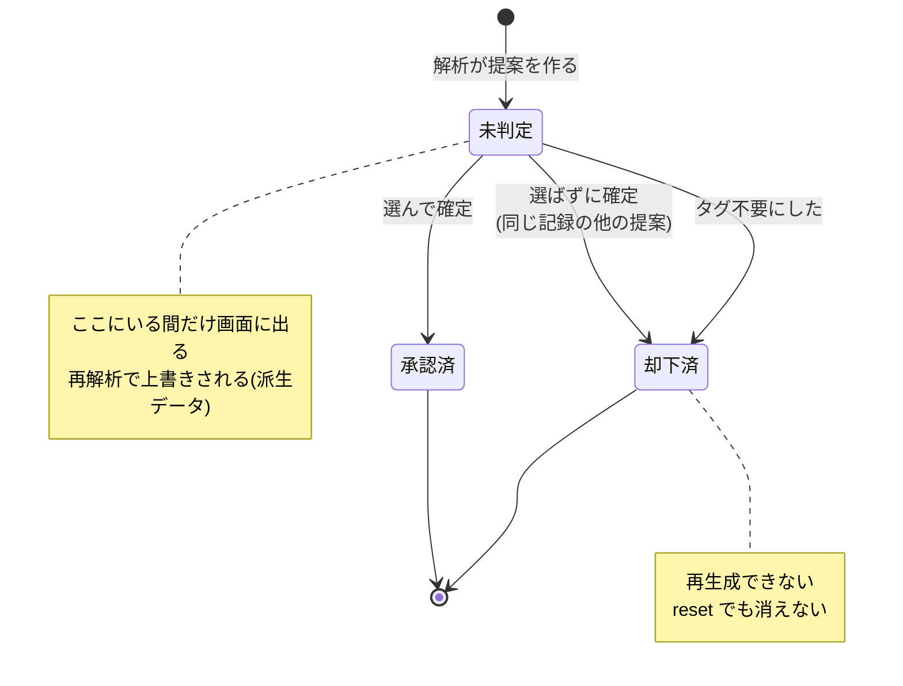
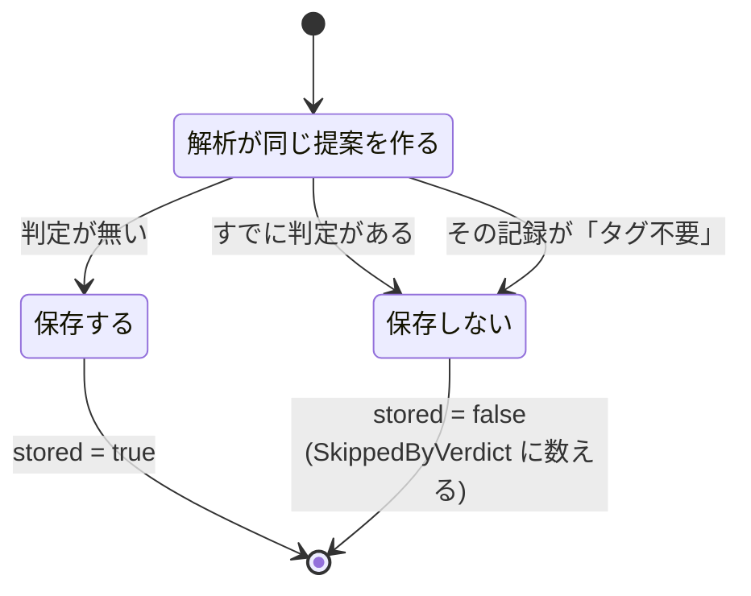
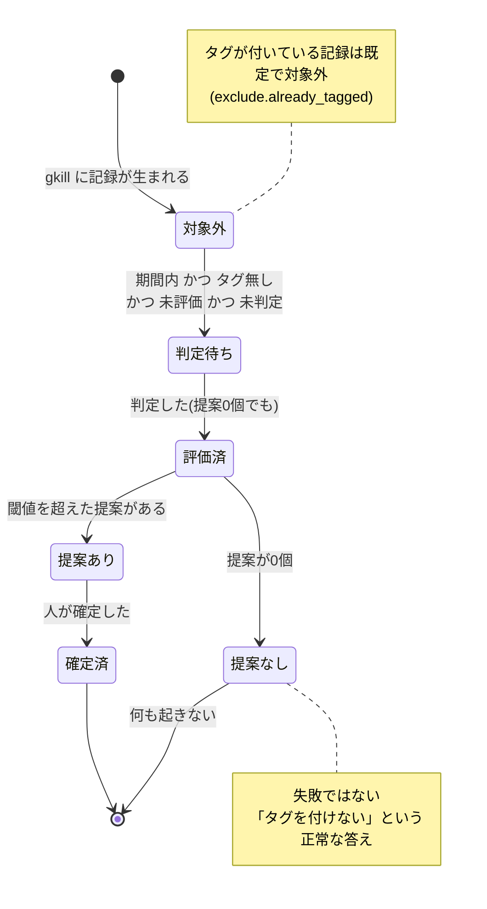
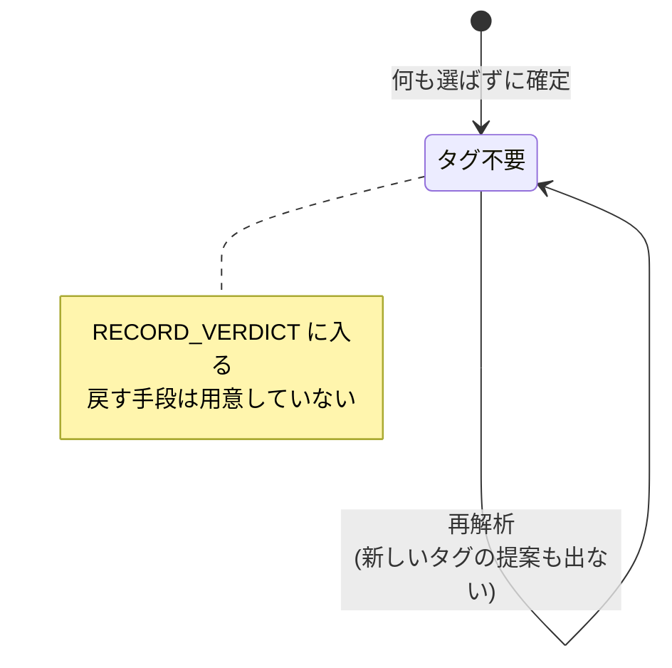
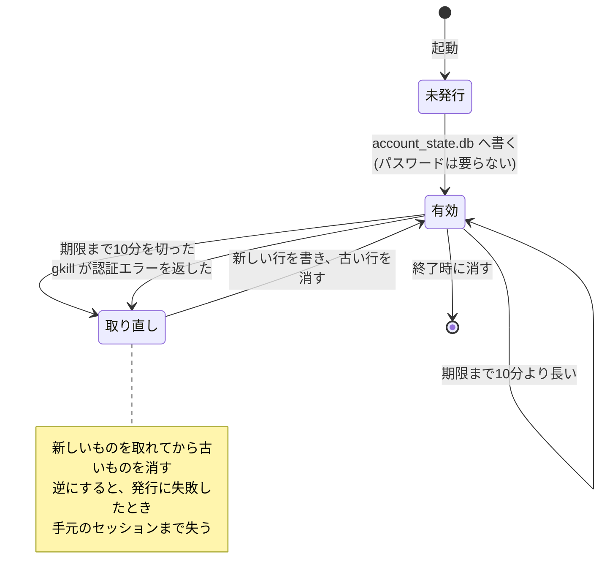
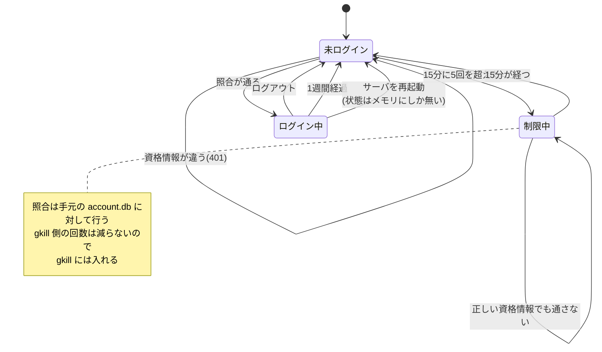
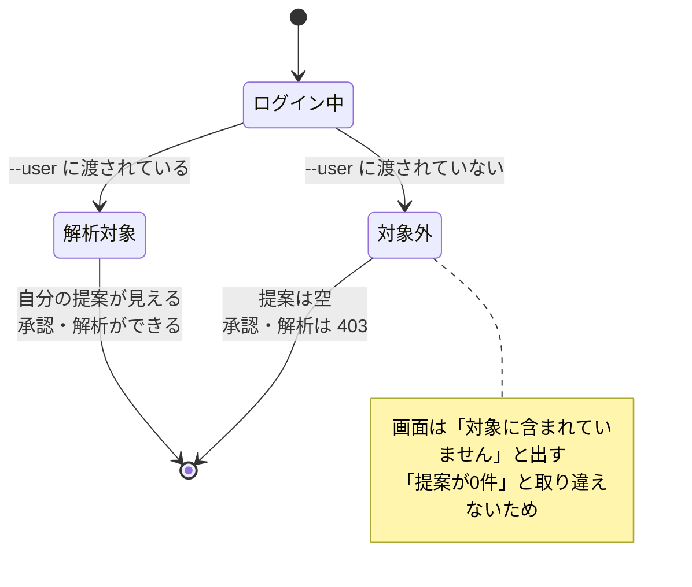
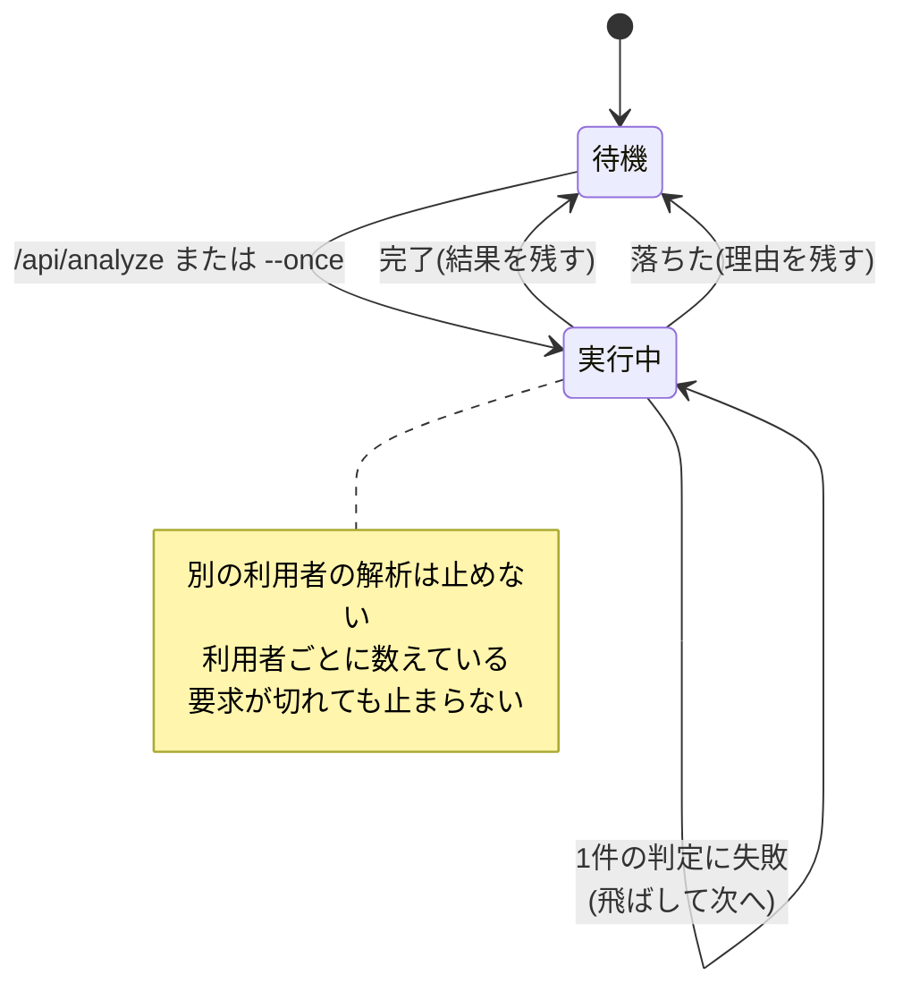

# ステートマシン図

状態を持つものは3つです。**提案**、**記録**、**セッション**。

## 1. 提案の状態

提案1件は「未判定」から始まり、人が触ると二度と戻りません。

**「未判定」へ戻る遷移はありません。** 取り消す手段を用意していないのは、
このツールの中心にある「却下したものが復活しない」と両立しないためです。

### 状態の判定のしかた

状態は列で持たず、表の有無で決まります。

| 状態 | 条件 |
| --- | --- |
| 未判定 | `SUGGESTION` にあり、`VERDICT` にも `RECORD_VERDICT` にも無い |
| 承認済 | `VERDICT.DECISION = 'approved'` |
| 却下済 | `VERDICT.DECISION = 'rejected'` |

`ListPending` はこの条件をそのまま SQL にしたものです。

### 再解析したときの振る舞い

識別子が `(記録ID, タグ名)` から決まるので、**同じ組み合わせは必ず同じ行**になります。
何度解析しても重複しません。

## 2. 記録の状態

記録は gkill にあるもので、こちらは「その記録をどう扱ったか」だけを持ちます。

### 「対象外」になる条件

| 条件 | 設定 |
| --- | --- |
| 期間の外 | `scope.candidate_days` |
| タグが1つでも付いている | `exclude.already_tagged`（既定 真） |
| 種別が対象外 | `scope.data_types`（空なら全種別） |
| リポジトリが対象外 | `scope.rep_prefixes`（空なら全リポジトリ） |
| すでに人が判定した | `VERDICT` / `RECORD_VERDICT` にある |
| すでに評価した | `EVALUATION` にある |

**「評価済」は派生データです。** `reset` で消えるので、設定を変えたあとは判定し直せます。
一方で人の判定は残るので、却下したものは復活しません。

### タグ不要にした記録

記録の一定割合は元々タグが要りません。実データでは、ある種類の記録の
約4分の1がそれに当たりました。覚えておかないと毎回蒸し返すことになります。

## 3. セッションの状態

2種類あります。**gkill を叩くためのもの**と、**確認画面のログイン状態**です。

### 3.1 gkill を叩くセッション

有効期間は **1週間**、取り直しは期限の **1時間前**からです。
gkill のサブコマンドは5分ですが、確認画面は何日も上がったままになるので足りません。

長い期限は、gkill の `account_state.db` に長寿命の鍵を置くということです。
終了時には必ず消しますが、強制終了させられると期限まで残ります。
それでも危険が増えないのは、この鍵で読める先が
「同じ端末の設定ディレクトリに書ける人」の記録だけであるためです。

**gkill の `/api/login` は一度も叩きません。** そのため gkill 側のログイン回数を消費しません。

### 3.2 確認画面のログイン状態

ログイン状態は**メモリにしか持ちません**。再起動すると全員入り直しになりますが、
確認画面は自分で建てて自分で使うものなので、それでよいと判断しました。

### 3.3 ログインした利用者の見え方

## 4. 解析の状態

利用者ごとに1つだけ走ります。

**実行中は要求の寿命と無関係です。** 画面は `GET /api/analyze/status` を
覗きに来るだけなので、タブを閉じても解析は続きます。止まるのは Ctrl+C のときだけです。

**1件の判定に失敗しても実行中のままです。** その記録を飛ばして次へ進み、
件数だけを `FailedRecords` に数えます。飛ばした記録は評価済みにしないので、
次の解析でやり直されます。落ちるのは、保存先に書けないなど解析そのものが
続けられない場合だけです。
