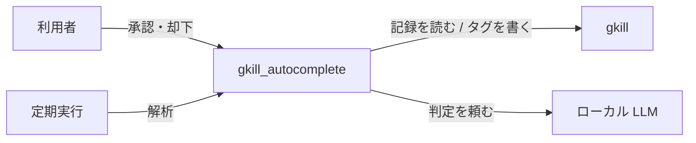
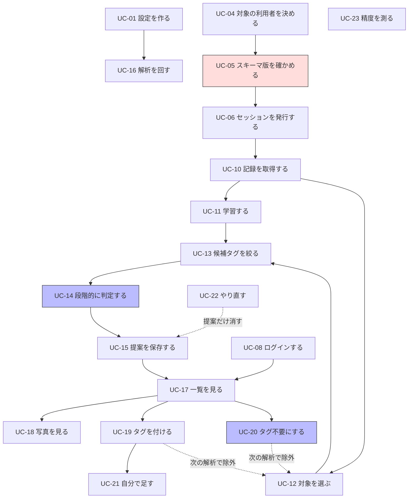

# ユースケース

このツールが「何をするか」の一覧です。実装の詳細は [program-spec.md](program-spec.md)、
取り決めの根拠は [requirements.md](requirements.md) を参照してください。

## 1. 登場人物

| 役 | 説明 |
| --- | --- |
| **利用者** | gkill に記録を溜めている人。提案を承認・却下する |
| **gkill** | 記録の保存先。読み取りと、承認されたタグの書き込み |
| **ローカル LLM** | 判定の第3段階を担う。同じ端末で動く |
| **定期実行** | タスクスケジューラや cron。解析を回す |

利用者と定期実行が能動的に動かし、gkill と LLM は呼ばれる側です。

## 2. 一覧

全 **24件**。番号は資料内で参照するためのものです。

### 2.1 準備（UC-01 〜 UC-04）

| # | ユースケース | 主体 | 概要 |
| --- | --- | --- | --- |
| UC-01 | 設定を作る | 利用者 | `init`。稼働中の gkill を解析し、使い方に合った設定を生成する |
| UC-02 | 既定の設定を見る | 利用者 | `--print-config`。何も触らずに既定値だけを出す |
| UC-03 | 使えるモデルを調べる | `init` | LLM に問い合わせ、名前から視覚用・本文用を選んで書き込む |
| UC-04 | 対象の利用者を決める | 利用者 | `--user`。繰り返して複数人を扱える |

### 2.2 認証（UC-05 〜 UC-09）

| # | ユースケース | 主体 | 概要 |
| --- | --- | --- | --- |
| UC-05 | スキーマ版を確かめる | 起動処理 | `account.db` が現行版でなければ**何もせず止まる** |
| UC-06 | ローカルセッションを発行する | 起動処理 | `account_state.db` へ直接書く。資格情報は要らない |
| UC-07 | セッションを取り直す | クライアント | 期限が近い、または gkill が認証エラーを返したとき |
| UC-08 | 確認画面へログインする | 利用者 | gkill のアカウントで照合する |
| UC-09 | ログアウトする | 利用者 | 手元のログイン状態を捨てる |

### 2.3 解析（UC-10 〜 UC-16）

| # | ユースケース | 主体 | 概要 |
| --- | --- | --- | --- |
| UC-10 | 記録を取得する | 解析 | 学習範囲ぶんを1回で取る。上限に達したら警告する |
| UC-11 | 履歴から学習する | 解析 | 文脈ごとのタグの出現・時刻分布・本文の索引・参考例を作る |
| UC-12 | 対象を選ぶ | 解析 | 期間内・タグ無し・未判定・未評価の記録に絞る |
| UC-13 | 候補タグを絞る | 判定 | 同じ文脈での実績が閾値以上のタグだけを候補にする |
| UC-14 | 段階的に判定する | 判定 | ルール → 逐語一致 → 近傍・語 → LLM。上で決まれば下へ行かない |
| UC-15 | 提案を保存する | 解析 | 判定済みの記録は蒸し返さない |
| UC-16 | 解析を1回だけ回す | 定期実行 | `--once`。画面を開かない |

### 2.4 確認と承認（UC-17 〜 UC-21）

| # | ユースケース | 主体 | 概要 |
| --- | --- | --- | --- |
| UC-17 | 提案の一覧を見る | 利用者 | 記録ごとにまとめて、新しい順に並ぶ |
| UC-18 | 写真を見る | 利用者 | gkill から中継する。ディスクには残さない |
| UC-19 | タグを選んで確定する | 利用者 | 選んだものだけを gkill へ書き込む |
| UC-20 | タグ不要として確定する | 利用者 | 何も選ばずに確定。**二度と提案しない** |
| UC-21 | 自分でタグを足す | 利用者 | 候補に無いタグを入力して承認できる |

### 2.5 調整と検証（UC-22 〜 UC-24）

| # | ユースケース | 主体 | 概要 |
| --- | --- | --- | --- |
| UC-22 | 提案を捨ててやり直す | 利用者 | `reset`。**人間の判定は消えない** |
| UC-23 | 精度を測る | 利用者 | `benchmark`。過去の期間で当たり具合を見る。書き込まない |
| UC-24 | 画面をホーム画面に入れる | 利用者 | PWA としてインストールする |

## 3. 主要なユースケースの詳細

### UC-14 段階的に判定する

**このツールの中心。** 候補タグごとに独立して当否を決めるので、**結果は0個にも複数個にもなります**。

| 段階 | 手段 | LLM | 確信度 |
| --- | --- | --- | --- |
| 0 | 設定のルール | 不要 | 設定値（既定 0.9） |
| 1 | 本文が過去の記録と逐語一致 | 不要 | `exact_text_match_confidence`（既定 0.95） |
| 2 | 近傍の記録・記録自身の語との一致 | 不要 | 0.8（自分の本文）/ 0.7（近傍） |
| 3 | LLM に候補タグの当否を尋ねる | 要 | LLM の自己申告 |

段階2と3の結果は「その文脈でタグを付けない割合」で割り引きます。
段階0と1は直接の証拠なので割り引きません（[requirements.md](requirements.md) 6.2）。

**事前条件**: 候補タグが1つ以上ある
**事後条件**: 閾値を超えた提案が0個以上得られ、記録が評価済みになる
**例外**: LLM に繋がらない → その記録の判定を中断し、解析全体を止める

### UC-20 タグ不要として確定する

**記録の一定割合は元々タグが要りません。** 実データでは、ある種類の記録の約4分の1がそれに当たりました。
これを覚えておかないと、同じ記録を毎回蒸し返すことになります。

**事前条件**: その記録に未判定の提案がある
**事後条件**:
- `RECORD_VERDICT` にその記録が入る
- その記録の未判定の提案がすべて却下になる
- **次の解析でその記録に新しい提案が出ない**（タグ名が違っても出ない）

**例外**: なし。取り消す手段は意図的に用意していません（[design-philosophy.md](design-philosophy.md)）

### UC-05 スキーマ版を確かめる

**壊れると取り返しがつかないので、専用のユースケースとして扱います。**

gkill のアカウント DAO は旧スキーマの DB を開いた瞬間に自動移行を走らせ、
**全アカウントのパスワードを無効化してリセットトークンを再発行します**。

**事前条件**: `$GKILL_HOME/configs/account.db` が実在する
**事後条件**: スキーマ版が現行版であることが確認できている
**例外**:
- ファイルが無い → `ErrAccountDBNotFound` で止まる
- 版が違う → `ErrAccountSchemaOutdated` で止まり、先に gkill を起動するよう案内する

**この検査は DAO を通しません。** DAO のコンストラクタが移行の入口だからです。

## 4. ユースケース同士の関係

点線は「結果が次の実行に影響する」ことを表します。人間の判定は解析の入力になります。

## 5. やらないこと

| やらないこと | 理由 |
| --- | --- |
| 提案を自動で適用する | 提案するだけ、が前提。勝手にタグが増える形にしない |
| まとめて承認する | 1件ずつ見ないと誤りが混ざる。手間を惜しむと精度が落ちる |
| 判定を取り消す | 「却下したものが復活しない」と両立しない |
| gkill 本体を変更する | 衛星リポジトリとしての立場を保つ |
| クラウドの LLM を使う | 記録の本文と写真を外へ出さない |
| タグを新規に作る | 候補は履歴の実績から決まる。コードに特定のタグ名を書かない |
